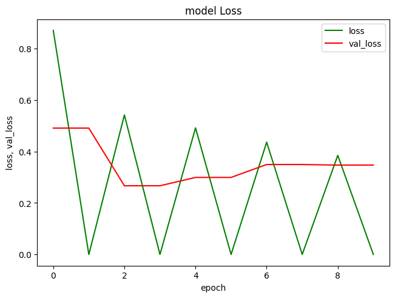

# Notatka CNN

## Parametry warstwy modelu
Parametry warstwy modelu to wartości, które sieć neuronowa uczy się podczas treningu. Są to wagi i biasy, które są dostosowywane w procesie uczenia, aby poprawić dokładność modelu.

## Warstwa Dropout
Warstwa Dropout w sieciach neuronowych służy do zapobiegania zjawisku przeuczenia (overfitting). Przeuczenie to sytuacja, gdy model zbyt dobrze dopasowuje się do danych treningowych, co skutkuje słabą generalizacją na nowe, nieznane dane.

## Argument funkcji Dropout()
Argument funkcji `Dropout()` w TensorFlow to `rate`, który określa frakcję wejściowych jednostek do wyłączenia. Jest to wartość zmiennoprzecinkowa między 0 a 1. Na przykład, `rate=0.1` oznacza, że 10% jednostek wejściowych zostanie wyłączonych podczas treningu.

## Ostatnia warstwa z jednym neuronem
Ostatnia warstwa modelu sieci neuronowej, która ma jeden neuron, jest często używana w problemach klasyfikacji binarnej. W takim przypadku, pojedynczy neuron w ostatniej warstwie zwraca wartość od 0 do 1 (dzięki funkcji aktywacji sigmoid), która jest interpretowana jako prawdopodobieństwo przynależności do jednej z dwóch klas.

## K.image_data_format()
Funkcja `K.image_data_format()` w Kerasie zwraca aktualny format danych obrazu, który jest albo "channels_first" albo "channels_last". Format "channels_first" oznacza, że kanał koloru jest pierwszym wymiarem w danych obrazu (np. `[channels, height, width]`), podczas gdy "channels_last" oznacza, że kanał koloru jest ostatnim wymiarem (np. `[height, width, channels]`).

## Konwolucja
Konwolucja to operacja matematyczna, która jest podstawą dla warstw konwolucyjnych w sieciach neuronowych. W kontekście przetwarzania obrazów, konwolucja polega na przesuwaniu "filtra" lub "kernela" po obrazie i obliczaniu sumy iloczynów pomiędzy wartościami pikseli obrazu a odpowiadającymi im wartościami w filtrze. 

Konwolucja pomaga w wykrywaniu lokalnych cech w obrazie, takich jak krawędzie, linie czy kształty, które są potem wykorzystywane przez sieć do klasyfikacji obrazów.

## Kernel
Kernel, nazywany również filtrem, to mała macierz, która jest używana do przeprowadzenia operacji konwolucji na obrazie. Wartości w kernelu są parametrami, które sieć neuronowa uczy się podczas treningu. 

Różne kernele mogą wykrywać różne cechy w obrazie. Na przykład, pewne kernele mogą być dobre w wykrywaniu krawędzi pionowych, podczas gdy inne mogą być dobre w wykrywaniu krawędzi poziomych.

## Pooling
Pooling to operacja redukcji wymiarowości, która jest często stosowana po warstwach konwolucyjnych w sieciach neuronowych. Pooling pomaga w zmniejszeniu ilości parametrów modelu, co przyspiesza trening i pomaga zapobiegać przeuczeniu.

Najczęściej stosowanym typem operacji pooling jest max pooling, który zwraca maksymalną wartość z określonego obszaru obrazu. Inne typy operacji pooling to average pooling (zwraca średnią wartość) i L2-norm pooling (zwraca pierwiastek kwadratowy z sumy kwadratów wartości).

## Kompilacja modelu sieci neuronowej
Kod, który został wybrany, dotyczy kompilacji modelu sieci neuronowej za pomocą biblioteki TensorFlow. Kompilacja jest etapem, w którym konfigurujemy proces uczenia modelu. Wykorzystujemy do tego funkcję `compile()`, która przyjmuje trzy kluczowe argumenty:

1. `loss`: Jest to funkcja straty, która jest optymalizowana podczas treningu. Funkcja ta oblicza stratę pomiędzy prawdziwymi etykietami a przewidywaniami modelu.

2. `optimizer`: Jest to algorytm używany do aktualizacji wag modelu na podstawie obliczonej straty.

3. `metrics`: Jest to lista metryk, które są obliczane podczas treningu i walidacji. Metryki te pomagają ocenić wydajność modelu.

```python
model.compile(loss='binary_crossentropy', optimizer='rmsprop', metrics=['accuracy'])
```
## Funkcja straty
Funkcja straty, znana również jako funkcja kosztu, jest kluczowym elementem w procesie uczenia sieci neuronowych. Jest to miara, jak bardzo przewidywania modelu różnią się od rzeczywistych wartości. Podczas treningu sieci neuronowej, celem jest minimalizacja wartości funkcji straty poprzez odpowiednie dostosowanie wag w sieci.

## Augmentacja Danych

Augmentacja danych to technika stosowana w uczeniu maszynowym, która polega na sztucznym zwiększaniu ilości danych treningowych poprzez wprowadzanie losowych zmian do istniejących próbek. W kontekście przetwarzania obrazów, takie zmiany mogą obejmować operacje takie jak przesunięcie (shear), powiększenie (zoom), odbicie (flip) czy obrót obrazu. 

Augmentacja danych jest szczególnie przydatna w przypadku małych zestawów danych, ponieważ pomaga zapobiegać przeuczeniu modelu poprzez zwiększenie różnorodności danych treningowych. Dzięki temu, model ma możliwość uczenia się na większej i bardziej zróżnicowanej ilości danych, co zazwyczaj prowadzi do lepszej generalizacji.

Augmentacja danych odbywa się podczas procesu treningu modelu. W przypadku użycia generatora danych, takiego jak `ImageDataGenerator` z biblioteki TensorFlow, augmentowane obrazy są generowane na bieżąco podczas treningu. Dzięki temu, nawet bardzo duże zestawy danych mogą być efektywnie przetwarzane bez konieczności ładowania ich wszystkich do pamięci naraz. Warto jednak zauważyć, że dokładna ilość danych po augmentacji nie jest z góry określona, ponieważ `ImageDataGenerator` generuje nowe, losowo transformowane obrazy na bieżąco.

# Interpretacja Wykresu Funkcji Straty

Wykres funkcji straty modelu podczas procesu uczenia przedstawia zmiany w wartości funkcji straty modelu w trakcie kolejnych epok. Na osi X mamy epoki - każda epoka to jedno przejście przez cały zestaw danych treningowych. Na osi Y mamy wartość funkcji straty.



Dwie linie na wykresie reprezentują:

- `loss` (zielona linia): To jest wartość funkcji straty na zbiorze treningowym. Pokazuje, jak dobrze model uczy się na danych treningowych. Im niższa wartość, tym lepiej model radzi sobie z przewidywaniem wyników na danych, na których się uczy.

- `val_loss` (czerwona linia): To jest wartość funkcji straty na zbiorze walidacyjnym. Pokazuje, jak dobrze model radzi sobie z przewidywaniem wyników na nowych, nieznanych mu wcześniej danych. Im niższa wartość, tym lepiej model radzi sobie z generalizacją swojej wiedzy na nowe dane.

Różnica między tymi dwoma liniami pokazuje, jak dobrze model generalizuje swoją wiedzę. Jeśli linie są blisko siebie i mają podobne wartości, oznacza to, że model dobrze radzi sobie zarówno z uczeniem się, jak i generalizacją. Jeśli linia `val_loss` jest znacznie wyższa od linii `loss`, może to oznaczać, że model jest przeuczony - dobrze radzi sobie z danymi treningowymi, ale nie jest w stanie dobrze przewidywać wyników na nowych danych.